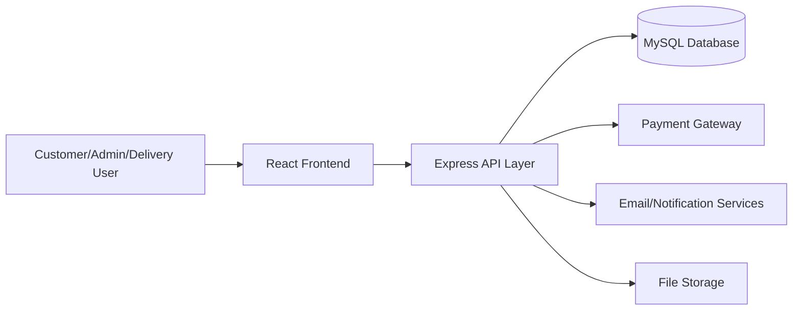

# Batla Medicos Shop
## College Project Report

---

## Title Page (Fill Before Submission)

Project Title: Batla Medicos Shop - Online Pharmacy and Health Services Platform

Submitted by:
- Name: ______________________
- Roll Number: ______________________
- Class/Semester: ______________________
- Department: ______________________

Submitted to:
- Guide Name: ______________________
- Department/College Name: ______________________
- Academic Session: ______________________

Submission Date: ______________________

---

## Certificate (Template)

This is to certify that the project titled "Batla Medicos Shop - Online Pharmacy and Health Services Platform" is a bonafide work carried out by ______________________ under my guidance during the academic session ______________________.

Guide Signature: ______________________

Head of Department Signature: ______________________

---

## Declaration (Template)

I hereby declare that this project report titled "Batla Medicos Shop - Online Pharmacy and Health Services Platform" is my original work and has not been submitted elsewhere for any degree or diploma.

Student Signature: ______________________

---

## Acknowledgement

I would like to express my sincere gratitude to my project guide, faculty members, and my college for their continuous support and guidance during the development of this project. I also thank my friends and family for their encouragement.

---

## Abstract

Batla Medicos Shop is a full-stack web platform developed to digitize pharmacy operations and improve customer convenience. The system allows users to search medicines, place online orders, upload prescriptions, book lab tests, track order status, and manage personal health-related activities from a single interface. The platform also includes dedicated admin and delivery modules for complete business workflow management.

The frontend is built using React and Vite, while the backend is built with Node.js, Express.js, and MySQL. The project implements authentication, role-based authorization, payment integration, notifications, and secure file upload. Additional features include coupon management, reviews, offers, category/brand management, and healthcare service expansion through lab test booking.

The main objective of this project is to provide an accessible, reliable, and scalable digital pharmacy solution for local customers while improving operational efficiency for the store owner.

---

## Table of Contents

1. Introduction
2. Problem Statement
3. Objectives
4. Scope
5. Existing vs Proposed System
6. Feasibility Study
7. System Requirements
8. Technology Stack
9. System Architecture
10. Database Design
11. Module Description
12. Implementation Details
13. Testing and Validation
14. Results and Outcomes
15. Limitations
16. Future Scope
17. Conclusion
18. References

---

## 1. Introduction

The healthcare and pharmacy sector is rapidly shifting toward digital platforms. Traditional pharmacy shops face challenges such as manual order handling, stock visibility issues, delayed communication, and limited service hours for order management. Batla Medicos Shop addresses these challenges by providing an integrated online pharmacy system.

This project is designed as a practical college-level software engineering implementation of a real business use case. It combines e-commerce features with healthcare-specific workflows such as prescription validation and lab test booking.

---

## 2. Problem Statement

Local pharmacy customers often face problems such as:

1. Difficulty in checking medicine availability remotely.
2. Delay in placing urgent medicine orders.
3. Manual prescription verification process.
4. Limited visibility of order status.
5. No integrated platform for medicine, prescription, and lab services.

The project solves these problems through a web-based system with customer, admin, and delivery workflows.

---

## 3. Objectives

1. Build an online medicine ordering platform for Batla Medicos.
2. Provide secure user authentication and account management.
3. Support prescription upload and admin approval flow.
4. Enable order placement, payment, and real-time order status tracking.
5. Enable lab test discovery and booking.
6. Provide an admin panel for products, categories, users, orders, offers, and coupons.
7. Improve pharmacy service quality and operational efficiency.

---

## 4. Scope

### In Scope

1. Product browsing with search/filter/sort.
2. Cart and checkout workflow.
3. Prescription upload and management.
4. Lab tests and lab booking.
5. Customer account, wishlist, reminders, notifications.
6. Admin and delivery panel support.

### Out of Scope

1. Native mobile app implementation in this phase.
2. Multi-vendor pharmacy model.
3. Hospital EMR integration.

---

## 5. Existing vs Proposed System

| Parameter | Existing Manual Process | Proposed Batla Medicos System |
|---|---|---|
| Order placement | Phone or physical visit | Online order via web app |
| Prescription handling | Manual and unstructured | Upload + status workflow |
| Tracking | Customer must call store | Live status updates in account |
| Promotions | Offline only | Digital offers and coupons |
| Lab bookings | Separate process | Integrated lab booking module |
| Reporting | Manual records | Admin dashboard + database records |

---

## 6. Feasibility Study

### Technical Feasibility

The stack (React, Node.js, MySQL) is stable, open-source, and suitable for scalable web application development.

### Economic Feasibility

The project uses cost-effective technologies and can run on standard cloud/cPanel hosting, reducing infrastructure cost.

### Operational Feasibility

The workflow matches real pharmacy operations and can be adopted gradually by store staff.

---

## 7. System Requirements

### Hardware Requirements

1. Minimum 8 GB RAM development machine.
2. Dual-core or higher processor.
3. Stable internet connection.

### Software Requirements

1. Node.js (v20+)
2. npm (v10+)
3. MySQL Server
4. VS Code
5. Modern browser (Chrome/Edge/Firefox)

---

## 8. Technology Stack

### Frontend

1. React
2. Vite
3. React Router
4. Axios
5. React Hook Form + Zod
6. React Hot Toast

### Backend

1. Node.js
2. Express.js
3. MySQL2
4. JWT Authentication
5. Multer (file upload)
6. Helmet, CORS, Rate Limiting

### Integrations

1. Razorpay (payment)
2. Cloudinary (media handling)
3. Nodemailer (email)

---

## 9. System Architecture

The system follows a three-layer architecture:

1. Presentation Layer: React frontend.
2. Application Layer: Express REST APIs.
3. Data Layer: MySQL relational database.

---

## 10. Database Design

Key tables used in the project:

1. users
2. categories
3. products
4. orders
5. order_items
6. prescriptions
7. coupons
8. notifications
9. lab_tests
10. lab_bookings
11. reviews
12. offers
13. brands
14. availability_requests
15. audit_logs
16. refresh_tokens
17. security_events

### Important Table Purpose

| Table | Purpose |
|---|---|
| users | Customer/admin/superadmin data and auth details |
| products | Medicine catalog, pricing, stock, prescription requirement |
| orders | Main order record with status and payment details |
| order_items | Item-wise order breakdown |
| prescriptions | Uploaded prescription and verification state |
| lab_tests | Test catalog for diagnostics |
| lab_bookings | Test booking data and status |
| coupons | Discount rules and usage tracking |

---

## 11. Module Description

### A. Customer Module

1. Register, login, forgot/reset password.
2. Browse products by categories/brands/search.
3. Add to cart and checkout.
4. Upload prescription and view status.
5. Track orders and view order history.
6. Book lab tests.
7. Manage wishlist, reminders, and account.

### B. Admin Module

1. Dashboard and analytics.
2. Product/category/brand management.
3. Order and status management.
4. User management.
5. Coupon/offer/promotion management.
6. Prescription approval workflow.
7. Lab test and booking management.

### C. Delivery Module

1. Delivery panel for assigned orders.
2. Delivery progress update.
3. Delivery OTP verification.

---

## 12. Implementation Details

### Frontend Routing Highlights

1. Public pages: home, products, diseases, lab, legal pages.
2. Auth pages: login, register, verify email, forgot/reset password.
3. Protected pages: checkout, orders, account, notifications, prescriptions.
4. Admin panel routes under /admin.
5. Delivery route under /delivery.

### Backend API Highlights

1. /api/auth for authentication.
2. /api/products for catalog operations.
3. /api/orders for order lifecycle and payment verification.
4. /api/prescriptions for upload and approval workflow.
5. /api/lab for tests and bookings.
6. /api/admin for admin operations.

### Security Features

1. Role-based middleware (customer/admin/superadmin).
2. Helmet security headers.
3. CORS allowlist.
4. API rate limiting.
5. JWT-based authentication with refresh token support.
6. Restricted upload serving policies.

---

## 13. Testing and Validation

### Testing Types Performed

1. Functional testing (module-wise flow verification).
2. API testing (request/response and validation checks).
3. Form validation testing.
4. Role and access control testing.
5. Basic security testing for unauthorized access.

### Sample Test Cases

| Test ID | Scenario | Expected Result |
|---|---|---|
| TC-01 | User registration with valid data | Account created successfully |
| TC-02 | Login with wrong password | Error message displayed |
| TC-03 | Add product to cart | Product added and total updated |
| TC-04 | Place order with COD | Order created with placed status |
| TC-05 | Upload prescription | Record created with pending status |
| TC-06 | Admin approves prescription | Status changes to approved |
| TC-07 | Non-admin hits admin API | Access denied |
| TC-08 | Book lab test with required details | Booking created successfully |

---

## 14. Results and Outcomes

The developed system successfully demonstrates:

1. End-to-end online medicine ordering.
2. Prescription-aware pharmacy flow.
3. Integrated lab booking service.
4. Secure admin management capabilities.
5. Improved customer convenience and transparency.

### Suggested Screenshots for Final Printed Report

1. Home page
2. Product catalog page
3. Checkout page
4. Prescription upload page
5. Orders page
6. Admin dashboard

---

## 15. Limitations

1. Current implementation is web-first; native mobile app is future scope.
2. Advanced analytics and AI recommendation engine can be enhanced further.
3. Multi-store inventory sync is not included in this phase.

---

## 16. Future Scope

1. Native Android/iOS app.
2. AI-based medicine recommendation and symptom triage.
3. Real-time delivery tracking map.
4. Multi-branch pharmacy support.
5. Regional language interface and voice support.
6. Teleconsultation integration with doctors.

---

## 17. Conclusion

Batla Medicos Shop project successfully transforms a traditional pharmacy model into a digital, service-oriented platform. The system combines medicine commerce, prescription validation, lab booking, and role-based administration in a single integrated solution. From an academic perspective, this project demonstrates practical implementation of full-stack development, database design, secure API development, and real-world workflow automation.

The project is suitable for college submission as a complete and domain-relevant software engineering solution.

---

## 18. References

1. React Documentation - https://react.dev/
2. Vite Documentation - https://vitejs.dev/
3. Node.js Documentation - https://nodejs.org/
4. Express.js Documentation - https://expressjs.com/
5. MySQL Documentation - https://dev.mysql.com/doc/
6. Razorpay Documentation - https://razorpay.com/docs/
7. OWASP Web Security Guidelines - https://owasp.org/

---

## Appendix A - Local Setup Commands

### Backend

1. cd backend
2. npm install
3. npm run dev

### Frontend

1. cd frontend
2. npm install
3. npm run dev

---

## Appendix B - Viva Questions (Quick Prep)

1. Why did you choose React + Node + MySQL?
2. How is authentication implemented?
3. How does prescription validation work in your system?
4. What security measures are implemented in APIs?
5. How is payment verified?
6. What are your future enhancements?
