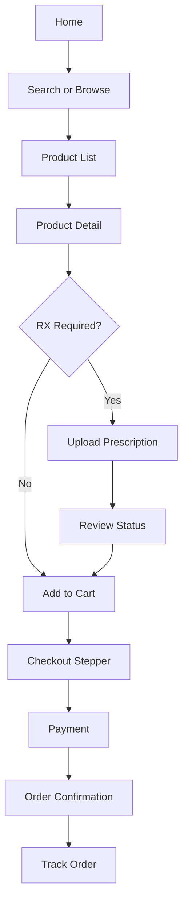

# HCI Project: Batla Medicos Website

## 1. Project Summary

This document is a complete Human Computer Interaction (HCI) project report for the Batla Medicos website.

- Product: Batla Medicos online pharmacy and health services platform
- Channels: Web app (customer), admin panel, delivery portal
- Current stack context: React frontend + Node/Express backend
- Core user goals:
  - Search and buy medicines
  - Upload prescription and get approval
  - Book lab tests
  - Track orders and manage account

## 2. Problem Statement

Batla Medicos offers many useful services, but the user journey can become cognitively heavy during critical tasks such as medicine search, prescription upload, and checkout. In healthcare commerce, users are often stressed, time-constrained, or less digitally confident. The interface should reduce effort, prevent mistakes, and increase trust.

HCI challenge:

- How might we make medicine purchase and prescription workflows faster, clearer, safer, and more inclusive for users of different ages and digital literacy levels?

## 3. Project Objectives

1. Reduce friction in high-value journeys (search -> cart -> checkout).
2. Improve prescription upload completion and clarity.
3. Increase trust signals in medicine authenticity and delivery reliability.
4. Improve accessibility for mobile-first and older users.
5. Define measurable usability metrics and target outcomes.

## 4. Scope

### In Scope

- Homepage discovery and category exploration
- Product catalog search and filter behavior
- Prescription upload flow
- Checkout flow (delivery/takeaway + payment)
- Lab test booking entry flow
- Basic notification/trust communication patterns

### Out of Scope

- Backend architecture redesign
- Payment gateway internals
- Full admin workflow redesign
- Native app implementation

## 5. Existing Product Snapshot

Observed routes and major pages in the web app include:

- Public pages: Home, Product Catalog, Product Detail, Lab, Diseases
- Account pages: Orders, Notifications, Prescriptions, Account, Reminders
- Transaction pages: Checkout, Order details
- Auth pages: Login, Register, Forgot/Reset password

Important current strengths:

- Rich category coverage
- Trust messaging (licensed, genuine, local store credibility)
- Prescription upload support
- Multiple payment options (including COD)
- Delivery and takeaway model

## 6. User Research Plan (Lean)

### Methods

1. Contextual interviews (5 users)
2. Task-based usability tests (8 users)
3. Heuristic evaluation (Nielsen 10 heuristics)
4. Accessibility spot audit (WCAG 2.2 AA checks)

### Participant Profiles

1. Caregiver buyer (age 28-45)
2. Chronic-care repeat buyer (age 45-65)
3. Young convenience user (age 18-30)
4. Low digital-literacy local customer (mixed ages)

## 7. Personas

### Persona A: Aisha (Caregiver)

- Age: 34
- Goal: Quickly buy medicines for family and avoid mistakes
- Pain points: Confusing filters, fear of ordering wrong medicine
- Device: Android mobile

### Persona B: Mr. Khan (Chronic-care user)

- Age: 58
- Goal: Reorder monthly medicines reliably
- Pain points: Small text, too many options, payment anxiety
- Device: Mid-range smartphone

### Persona C: Sana (Student)

- Age: 22
- Goal: Fast OTC purchase with delivery estimate
- Pain points: Wants fast search and clear total cost
- Device: Mobile web

## 8. Primary User Journeys

### Journey 1: Buy non-prescription medicine

1. Open Home
2. Search or browse category
3. Open product details
4. Add to cart
5. Checkout
6. Place order and track

### Journey 2: Buy prescription-required medicine

1. Search product
2. Understand RX requirement
3. Upload prescription
4. Wait for approval status
5. Complete checkout after approval

### Journey 3: Book a lab test

1. Open lab section
2. Select test package
3. Provide schedule details
4. Confirm booking

## 9. Task Analysis (Current Pain Points)

| Task | Current Risk | User Impact | Severity (1-4) |
|---|---|---|---|
| Find exact medicine | Too many category paths and filters | Slow decision and drop-off | 3 |
| Understand RX rule | Requirement may appear late in flow | Failed checkout, frustration | 4 |
| Fill checkout form | Multiple fields and context switching | Higher form abandonment | 3 |
| Compare payment methods | Fee/trust details not always explicit | Hesitation at final step | 2 |
| Reorder previous items | Repeat flow not always obvious | Extra effort for chronic users | 3 |

## 10. Heuristic Evaluation (Nielsen)

| Heuristic | What Works | Gap Identified | Recommendation |
|---|---|---|---|
| Visibility of system status | Loading and toast feedback exists | Some async actions need stronger progress cues | Add inline step states and persistent status banners |
| Match with real world | Familiar pharmacy terms on home | Some category naming can be technical | Add plain-language aliases and helper text |
| User control and freedom | Filters and navigation available | Undo/clear paths can be inconsistent | Add global clear actions and back-to-results affordance |
| Consistency and standards | Similar UI patterns in many pages | Minor variation in labels/microcopy | Standardize button and status vocabulary |
| Error prevention | Validation exists in forms | RX dependency can feel late | Surface RX requirement at listing and cart level |
| Recognition over recall | Icons and categories are visible | Users still remember selected filters mentally | Show sticky active filter chips |
| Flexibility and efficiency | Search + category both supported | Repeat buyers need faster reorder path | Add one-tap reorder from past orders |
| Aesthetic/minimalist design | Modern visual style | Information density can spike on commerce pages | Progressive disclosure for advanced options |
| Error recovery | Toast errors available | Recovery actions are not always explicit | Add actionable error CTAs (retry, contact support) |
| Help and documentation | Trust and store details visible | Flow-specific help missing | Add contextual help in checkout and RX flow |

## 11. Accessibility Review (Quick Audit)

### Key Risks

1. Color contrast risk in muted secondary text and badges.
2. Focus visibility and keyboard traversal consistency.
3. Tap targets in dense mobile cards.
4. Form error messaging readability and placement.

### Accessibility Requirements

1. Minimum contrast ratio: 4.5:1 for body text.
2. Minimum touch target: 44x44 px.
3. Visible focus ring on all interactive controls.
4. ARIA labels for icon-only actions.
5. Descriptive alt text for medical product imagery where needed.

## 12. Proposed HCI Redesign

### A. Information Architecture Improvements

1. Add a single top-level "Quick Actions" block:
   - Search Medicine
   - Upload Prescription
   - Book Lab Test
   - Reorder Past Medicines
2. Merge overlapping category labels where possible.
3. Add breadcrumb + active filter chips in catalog pages.

### B. Search and Catalog Improvements

1. Smart search suggestions with:
   - Medicine name
   - Salt/composition
   - Common symptom tags
2. Show medicine type and RX requirement directly in result cards.
3. Add "Not available? Request medicine" as a first-class alternate action.

### C. Checkout Improvements

1. Step-based checkout UI:
   - Delivery details
   - Prescription check
   - Payment
   - Review and place order
2. Show final payable amount sticky at bottom on mobile.
3. Add trust strip near payment options (secure payment, COD available, support contact).

### D. Prescription Flow Improvements

1. Explain accepted file formats and quality examples before upload.
2. Show upload progress and immediate file quality validation.
3. Provide transparent status timeline:
   - Uploaded
   - Under review
   - Approved/Rejected with reason

### E. Repeat Purchase Flow

1. Add "Reorder in 1 click" in order history.
2. Add saved medicine list with monthly reminder options.

## 13. Conceptual Interaction Flow

## 14. Usability Testing Plan

### Test Design

- Type: Moderated remote + in-person mix
- Participants: 8 users
- Duration: 25-35 minutes each
- Devices: 6 mobile, 2 desktop

### Test Tasks

1. Find and add a specific OTC medicine to cart.
2. Upload a prescription for an RX medicine.
3. Complete checkout with delivery and COD.
4. Book one lab test.
5. Find order tracking information.

### Success Metrics

1. Task Completion Rate (TCR)
   - Formula: completed tasks / total tasks x 100
2. Average Time on Task
3. Error Rate (critical and non-critical)
4. Single Ease Question (SEQ) per task (1-7)
5. System Usability Scale (SUS) after session

### Target Benchmarks

- TCR >= 90%
- Checkout completion time <= 3.5 minutes (mobile median)
- RX upload failure rate <= 10%
- SUS >= 80

## 15. Baseline vs Target (Example)

| Metric | Current Estimate | Target After Redesign |
|---|---|---|
| Product find success | 78% | 92% |
| Checkout completion | 71% | 88% |
| RX upload completion | 63% | 85% |
| Avg. checkout time (mobile) | 5.2 min | 3.5 min |
| SUS score | 68 | 80+ |

## 16. Implementation Roadmap

### Sprint 1 (Week 1)

1. UX copy standardization
2. Category/filter IA cleanup
3. RX badges in list and cart

### Sprint 2 (Week 2)

1. Checkout stepper and sticky summary
2. Better form validation and inline recovery actions
3. Payment trust and support module

### Sprint 3 (Week 3)

1. Prescription timeline UI
2. Reorder quick action
3. Accessibility fixes (contrast, focus, touch targets)

### Sprint 4 (Week 4)

1. Usability test cycle
2. Final polish and bug fix pass
3. Measurement dashboard setup

## 17. Deliverables for Submission

1. HCI project report (this file)
2. Annotated wireframes (low/mid fidelity)
3. Test script and metrics sheet
4. Before/after usability findings
5. Final recommendation summary

## 18. Conclusion

Batla Medicos already has strong functional breadth and trust potential. The HCI opportunity is to simplify decisions, reduce effort in critical healthcare tasks, and improve accessibility for all user groups. With structured redesign and usability testing, the platform can increase conversion, reduce errors, and provide safer, faster, and more reassuring pharmacy interactions.

---

## Appendix A: Sample Moderator Script (Usability Test)

1. Intro: "Please complete tasks naturally and think aloud."
2. Warm-up: "How often do you buy medicines online?"
3. Execute task list without hints for first attempt.
4. Capture confusion points and recovery behavior.
5. Post-task SEQ rating after each task.
6. Final SUS questionnaire and debrief interview.

## Appendix B: Risk Register

| Risk | Likelihood | Impact | Mitigation |
|---|---|---|---|
| Users ignore RX rules | Medium | High | Show RX rule earlier + repeated cues |
| Form fatigue on mobile | High | Medium | Stepper + autofill + smart defaults |
| Trust drop at payment step | Medium | High | Security and support reassurance near CTA |
| Accessibility regressions | Medium | Medium | Include accessibility checks in QA definition |
